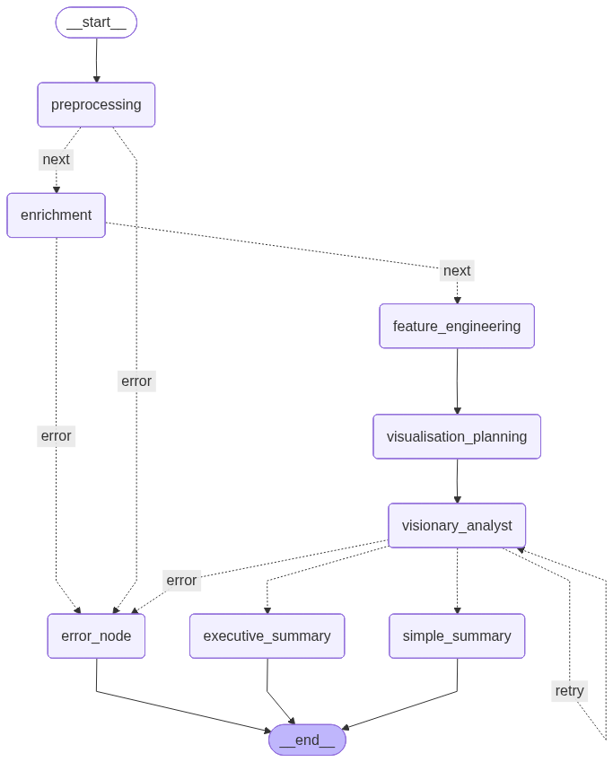

# Data Analysis AI Assistant (DAAA)
An end-to-end LangGraph-powered analytics engine that uses LLMs for semantic reasoning and Python-driven logic to ensure verifiable, accurate data insights.

[Try it on streamlit](https://data-analysis-ai-assistant-bekc9grzqbhigny4wpd8h2.streamlit.app/)

## 💭 Preface
Traditional analysis often fails by being either too rigid or too "black-box." This project bridges that gap by addressing the weaknesses of both extremes:
* Hard-coded logic is blind to semantics and visual patterns. A purely algorithmic approach can miss the "story" behind the numbers—failing to distinguish between datasets with identical statistics but vastly different distributions, such as Anscombe’s Quartet or the Datasaurus Dozen. Vision LLMs can help to "see" the context and visual significance of the data distribution.

* Large Language Models are notorious for hallucinations and mathematical errors. Entrusting an LLM with raw calculation or unsupervised reporting leads to "black-box" conclusions that cannot be audited. Strict Enums and a Hard-Coded Auditor Node are used to refrain AI drift away from the truth.

Therefore, by combining the strengths from both sides, I would like to build a simple but reliable AI assistant that can produce a report quickly for an overview or a guide to data analysts with minimum effort from the user.

## 🌟 Key Features

* Context-Aware Analysis: Uses LLMs to understand business metadata (filenames, column headers).
* Guaranteed Accuracy: The system enforces Enumerated Types (Enums) for all tool calls and node transitions. This prevents the LLM from hallucinating invalid chart types or non-existent data columns. Self-Correction Loop is also included to review whether the chart is well-prepared to derive accurate insight.
* Dynamic Visualization: Grounded by hard-coded charts to visualise data. Automatically generates chart specifications via PyGWalker with an optional "Advanced Explorer" mode for power users.
* Human-in-the-Loop: Integrated "Confirm/Stop" flow to keep the user in control of the AI's execution.

## 🏗️ System Architecture
This app follows a strictly defined Directed Acyclic Graph (DAG) workflow:

   * Preprocessing Node: Performs simple "Health Checks" to ensure data integrity before any analysis begins.
   * Context Enrichment Node: Uses the LLM to interpret metadata to bridge the gap between raw headers and business meaning and improve readability.
   * Feature Engineering Node: Identifies potential derived metrics or groupings that might reveal hidden patterns for deeper visual and statistical discovery.
   * Visualization Planning Node: Decide how to combine different columns to plot a meaningful chart to extract data insights. 
   * Visionary Analyst Node: Synthesize data patterns into high-level business narratives.
   * Executive Summary Node (The Closer): Compiles all findings and finalize the audit into an actionable report.

<details>
  <summary>Click to view Architecture</summary>
  <p align="center">
    
  </p>
</details>

## 🛠️ Tech Stack

* Orchestration: LangGraph (Multi-node State Machine)
* Frontend: Streamlit
* Data Engine: Pandas / PyGWalker 
* Visulisation: Matplotlib / seaborn
* Intelligence: LangChain + LLM (Ollama - Gemma3: 12B / Google - Gemini2.5 Flash Lite) or other Vision LLM

## 🚀 Getting Started

### 1. Requirements

* Python 3.10+
* At least 5 rows of valid CSV data.
* Clear filename and column names (e.g., Revenue vs Col_1).

### 2. Installation

Clone the repository and then install dependencies.

```
pip install -r requirements.txt
```

### 3. Run the App

```
streamlit run app.py
```

### 🧪 Try it with Samples
Don't have data? Toggle the "Use Local Test Samples" checkbox to run the app on curated Kaggle datasets located in the /test directory.


## ❓FAQ

Q: What is the primary use case for this application?

A: The engine is optimized for datasets centered around a single core metric (e.g., Churn Rate, Monthly Revenue). It is designed as a general-purpose analytic tool; it does not support domain-specific visualizations like financial OHLC charts.

Q: Is my data private and secure?

A: Yes. This application is compatible with local LLM orchestration via Ollama (e.g., Gemma3: 12B). On a consumer-grade PC, you can run the entire pipeline locally, ensuring your data never leaves your machine. If you choose to use cloud-based LLM services, we recommend opting out of data training within your provider's settings.

Q: Does the AI have access to real-world context or external APIs?

A: By design, the current version operates on a "Closed-Box" principle for security—it only processes the provided CSV to prevent prompt injection. However, the modular DAG architecture is fully extensible; it can be easily adjusted to include custom search tools or additional Human-in-the-Loop inputs for broader context.

## 📈 Improvements

1. Advanced Data Imputation & Cleaning

Currently, the system defaults to dropping null values and duplicates, as these are typically artifacts of the data collection process (e.g., sensor errors or network timeouts) rather than semantic features.

Solution: Integrate configurable cleaning strategies, such as Median/Mean Imputation for missing values and specialized Heuristic Handling for statistical outliers (e.g., Z-score or IQR-based filtering) before the data reaches the Analyst node.

Example code:

```
with col1:
    # Strategy for Missing Values
    impute_strategy = st.selectbox(
        "Handle Missing Values (Nulls):",
        options=["Drop Rows", "Fill with Mean", "Fill with Median", "Fill with Zero"],
        help="Choose how to treat empty cells in numeric columns."
    )
```

2. Expanded Visualization Library 

To maintain security, the current chart pool is constrained. We aim to transition toward a Dynamic Tool-Binding approach using LangChain.

Solution: Allow the AI to select from a broader "Chart Library." For example, the system could automatically decide between a Scatter Plot for correlation or a Heatmap for density, depending on the volume of the dataset.

3. Support for Layered Chart "Stacks"

The current architecture generates individual visualizations. A key improvement will be the ability to "Stack" visual tweaks to handle complex data distributions.

Solution: Support for composite layers, such as overlaying a 7-day Rolling Mean on top of a time-series bar chart or applying Faceting (Sub-plots) to compare categorical segments within a single view.


4. Human-in-the-Loop: Revise-able Context

Currently, the Context Enrichment node operates autonomously. We aim to introduce a verification step where the AI's semantic interpretations are presented to the user for refinement.

Solution: After the AI generates its initial "Context Map" (e.g., mapping rev_q4 to Quarterly Revenue), the workflow will pause. The user can edit descriptions, rename metrics, or correct misinterpretations directly in the UI. This refined "Ground Truth" is then fed back into the LangGraph state, ensuring all subsequent analysis is perfectly aligned with the user's domain knowledge.

## 🖼️ Sample Work


## 🫧 Similar Projects

These projects did provide insiprations to me. I recommend to have a look if you would like to study more on the data analysis technique.

[AI-Report-Generator](https://github.com/archanags001/AI-Report-Generator?tab=readme-ov-file): It demonstrates how to build a clean, automated report-drafting pipeline within a LangGraph ecosystem for individual CSV uploads. It’s a perfect starting point for understanding local agentic data workflows.

[First Text-to-SQL App](https://amanxai.com/2026/02/08/build-your-first-text-to-sql-app/#google_vignette): This project moves beyond static files to show how AI can connect directly to live databases. It highlights a more dynamic and interactive user experience, where natural language is translated into complex SQL queries to navigate massive datasets in real-time.

This project demostrated a specialized LLM trained to autonomously orchestrate the entire data science pipeline without pre-defined scripts, which is a good way to study how a data analysis should be done.

[DeepAnalyze](https://ruc-deepanalyze.github.io/): A research-grade, fully autonomous agent, distinct from smaller-scale, workflow-based tools by utilizing a specialized 8B model to manage the entire data science pipeline from diverse sources.

## ⚠️ Disclaimer

This application utilizes Large Language Models (LLMs) to process and interpret your data.

* Accuracy: While the AI is designed to be rigorous, it may occasionally produce incorrect insights, hallucinate trends, or suggest suboptimal visualizations.

* Verification: Always cross-reference AI-generated findings with your original dataset. This tool is intended to assist your analysis, not replace human judgment.

* No Professional Advice: The outputs of this app do not constitute financial, legal, or professional advice.
